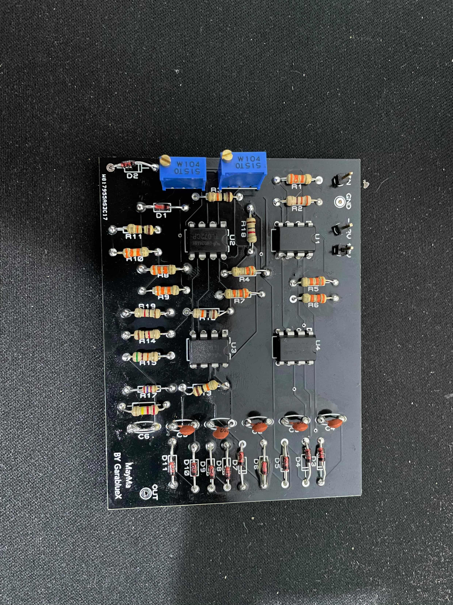

# ⭐ Sponsored by PCBWay

This project is proudly sponsored by **PCBWay**, who supported the PCB fabrication and assembly for the MayMa analog synthesizer module.
[https://www.pcbway.com](https://www.pcbway.com)

---

🎛️ **MayMa**
MayMa is my personal analog synthesizer project — a fully hand-designed, TL071-based analog circuit powered by ±12 V.
This project documents its complete journey: from schematic design and Proteus testing to Eurorack conversion, Altium integration, and final hardware assembly.

---

## 🛠️ PCB Arrival & Fabrication Quality

The first production run of the **MayMa** PCB has officially arrived, marking a major milestone in the project’s transition from simulation to real-world hardware.

/Closeup.JPG)

### Board Quality Highlights

* The silkscreen is rendered with **exceptional clarity and contrast** against the solder mask, making component placement and labeling immediately readable.
* Copper traces exhibit **crisp definition and precise routing**, with consistent widths and clean transitions.
* A **premium, uniform surface finish** across the entire board, reflecting high-quality materials and manufacturing standards.
* Potentiometer and terminal holes are drilled with **micron-level accuracy**, ensuring perfect mechanical alignment during assembly.
* Board edges are **smooth, clean, and professionally finished**, with no burrs or roughness.
* Overall **dimensional accuracy and alignment are flawless**, confirming excellent fabrication tolerances.

This PCB quality provides a solid foundation for reliable assembly, repeatable testing, and long-term durability during real-world operation.

---

## 🧭 Project Roadmap

| Stage                                                | Description                                                                                                                 |
| ---------------------------------------------------- | --------------------------------------------------------------------------------------------------------------------------- |
| **1️⃣ Schematics & Troubleshooting (Proteus + PCB)** | Designing, simulating, and debugging the full circuit in Proteus, followed by initial PCB layout and signal verification.   |
| **2️⃣ Eurorack Adaptation**                          | Converting the design for the Eurorack modular synth standard (±12 V rails, 3.5 mm jacks, 3U panel format).                 |
| **3️⃣ Altium Integration**                           | Migrating the schematic and layout into Altium Designer for refined routing, labeling, and front-panel artwork integration. |
| **4️⃣ Hardware & Assembly (Real-Life Testing)**      | Building, soldering, and evaluating the physical module — measuring audio response, CV behavior, and resonance stability.   |

---

## ✨ Features

* Pure analog design built around TL072 op-amps
* Modular, voltage-controlled signal path
* Drive and resonance shaping for expressive tone control
* Compatible with ±12 V power systems
* Ready for future Eurorack integration

---

## ⚙️ Technical Overview

| Parameter             | Description      |
| --------------------- | ---------------- |
| Supply rails          | ±12 V            |
| Op-amp type           | TL071            |
| Input signal          | 10 V p-p typical |
| Control voltage range | 0 – 2 V          |
| Output load           | ≥ 5 kΩ           |
| Current draw          | < 20 mA total    |

---

## 🧩 Connections

| Jack      | Function              | Notes                          |
| --------- | --------------------- | ------------------------------ |
| AUDIO IN  | Main audio input      |                                |
| AUDIO OUT | Output signal         | DC-blocked (1 µF)              |
| CV IN     | Control voltage input | 100 kΩ input, clamped to ±12 V |

---

## 🎛️ Controls

| Control                      | Function                               |
| ---------------------------- | -------------------------------------- |
| CUT CV                       | External voltage for frequency control |
| DRIVE (100 k)                | Adjusts input level / saturation       |
| RESONANCE (100 k + 5 k trim) | Sets feedback and oscillation onset    |

---

## 🧪 Testing

1. Power with ±12 V — verify the power LED is on.
2. Feed a 10 V p-p test signal into AUDIO IN.
3. Sweep CV IN between 0 – 9.5 V (slow triangle or DC ramp).
4. Observe tone and resonance behavior on the output.

---

## ⚠️ License / Usage Notice

**Project Name:** MayMa
**Author:** Saif AbdEssayed
**Email:** [abdessayedsaif@gmail.com](mailto:abdessayedsaif@gmail.com)

This is a personal project.
Any modification, redistribution, or usage of this repository, its schematics, or documentation requires **explicit permission** from the author.

© 2025 Saif AbdEssayed — All rights reserved.
